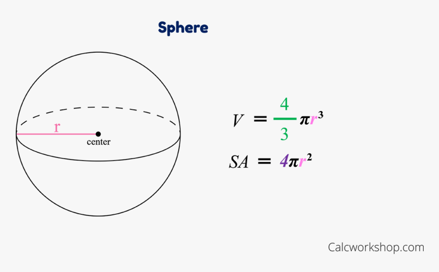
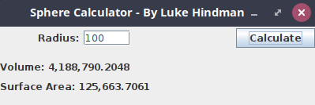
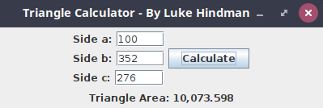

# Module 8 Lab Guide (part 1)
## Getting Started
[Lab Introduction Video](https://youtu.be/4qre8IRmaUw)

### Code Style Requirements
Please review the [CS121 Style Guide](https://docs.google.com/document/d/1LWbGQBKkApnNAzzgwOSvRM03DmhYWx5yEfecT2WXfjI/edit?usp=sharing) and apply it in all lab activities and projects this semester. Coding Style will assessed as part of your lab and project grades. 

### Code Quality Requirements
- Code must compile without warnings using openjdk11
- Code must run without errors or warnings on safe-path and edge test cases
- More to come as we learn about input validation and exception handling  

## Lab Warmup - Sphere Calculator
### Problem Description
In this activity we revisit an activity from earlier in the semester.  Write an application that prompts the user for the radius of a sphere and calculates its volume and surface area.  Use the following formulas, in which r represents the sphere's radius.  Display the results to four decimal places using JLabels and thethe DecimalFormat class. The calculated values should be updated with the user clicks the Calculate button or when the user presses enter in the text field.

### Program Design
The screenshot above shows a sample GUI for this activity.  You may use the same layout or design your own.  Either way, your GUI must contain the following components

+ **JButton:** You must include a JButton that will calculate the surface area and volume based upon the radius value stored in the JTextField. See the error handling section below for how to address unexpected values.
+ **JTextField:** You must include a JTextField that will allow the user to specify a radius value. Pressing enter in this field should trigger the same result as clicking the JButton.
+ **JLabel:** You must include a JLabel that includes the tagged value for volume
+ **JLabel:** You must include a JLabel that includes the tagged value for surface area

### Error Handling
When the Calculate JButton is pressed or when enter is pressed in the JTextField, it will read the current values from the radius JTextField.  If the user specified a non-numerical value for the volume, you should catch the NumberFormatException and display a JOptionPane with the message "Please enter numbers only!".  If the user specified a negative number, display a JOptionPane with the message "Please enter positive values only!".

### Implementation Guide
1. Expand the folder named  SphereCalculator and create a new file named SphereCalculator.java and open it.
2. Design a program to satisfy the requirements in the Problem Description and the Program Design above
3. Test the program and pay particular attention to boundary/edge cases and invalid input.
4. Commit the changes to your local repository with a message stating that Lab Warmup is completed.
5. Push the changes from your local repository to the github classroom repository.

## Lab Activity 1 - Triangle Calculator
### Problem Description
In this activity we are once again revisiting an activity from earlier in the semester.  Write an application that prompts the user to enter the lengths of the sides of a triangle. A JButton labelled Calculate should compute the area of the triangle using Heron's formula (below), in which s represents half of the perimeter of the triangle, and a, b, and c represent the lengths of the three sides. Display the area to three decimal places using a DecimalFormat object and a JLabel. Your program should NOT attempt to perform the calculation when enter is pressed in on the text fields.

### Requirements
The screenshot above shows a sample GUI for this activity.  You may use the same layout and general design or create your own.  Either way, your GUI must contain the following components:

+ **JButton:** You must include a JButton that will calculate the area based upon the values entered for each side in the JTextFields. See the error handling section below for how to address unexpected values.
+ **JTextField(s):** You must include JTextFields that will allow the user to specify the lengths of the sides (a, b and c). These values should be parsed using Double.parseDouble().
+ **JLabel:** You must include a JLabel that includes the tagged value for area

### Error Handling
When the Calculate JButton is pressed it will read the current values for the side lengths from the JTextFields.  If the user specified a non-numerical value for any of the sides, you should catch the NumberFormatException and display a JOptionPane with the message "Please enter numbers only!".  If the user specified a negative number, display a JOptionPane with the message "Please enter positive values only!".

### Implementation Guide
1. Expand the folder named TriangleCalculatore and create a new file named TriangleCalculator.java
2. Design a program to satisfy the requirements in the Problem Description and the Program Design above
3. Test the program and pay particular attention to boundary/edge cases and invalid input.
4. Commit the changes to your local repository with a message stating that Lab Activity 1 is completed.
5. Push the changes from your local repository to the github classroom repository.
