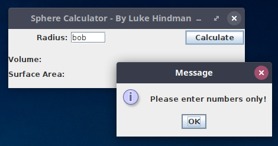
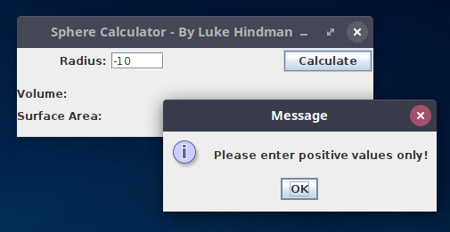
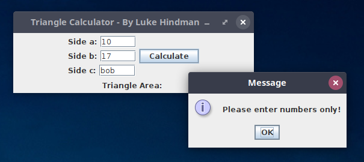
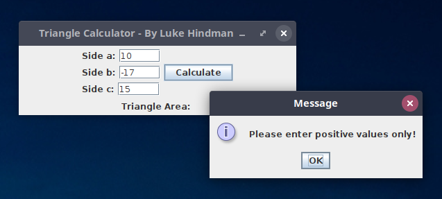
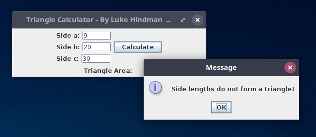

# Module 8 Lab Guide (part 1)
## Getting Started
[Lab Introduction Video](https://youtu.be/4qre8IRmaUw)

### Code Style Requirements
Please review the [CS121 Style Guide](https://docs.google.com/document/d/1LWbGQBKkApnNAzzgwOSvRM03DmhYWx5yEfecT2WXfjI/edit?usp=sharing) and apply it in all lab activities and projects this semester. Coding Style will assessed as part of your lab and project grades. 

### Code Quality Requirements
- Code must compile without warnings using openjdk11
- Code must run without errors or warnings on safe-path and edge test cases
- More to come as we learn about input validation and exception handling  

## Lab Warmup - Sphere Calculator
### Problem Description
In this activity we revisit an activity from earlier in the semester.  Write an application that prompts the user for the radius of a sphere and calculates its volume and surface area.  Use the following formulas, in which r represents the sphere's radius.  Display the results to four decimal places using **JLabel** components and the **DecimalFormat** class. The calculated values should be updated with the user clicks the Calculate button or when the user presses enter in the text field.

### Program Design

Create a new file called *SphereCalculator.java*, add a class called **SphereCalculator** that extends JPanel and include a ***main()*** method so that this class is a driver class as well. The screenshot below shows a sample GUI for this activity.  You may use the same layout or design your own.  Either way, your program must include the GUI components and functional behaviors listed here.

+ **JButton:** Include a JButton that will calculate the surface area and volume based upon the radius value stored in the JTextField. See the error handling section below for how to address unexpected values.
+ **JTextField:** Include a JTextField that will allow the user to specify a radius value. Pressing enter in this field should trigger the same result as clicking the JButton.
+ **JLabel:** Include a JLabel that includes the tagged value for volume
+ **JLabel:** Include a JLabel that includes the tagged value for surface area

### Error Handling
- When the Calculate **JButton** is pressed or when enter is pressed in the **JTextField**, it will read the current values from the radius **JTextField**.  If the user specified a non-numerical value for the volume, you should catch the **NumberFormatException** and display a **JOptionPane** with the message "Please enter numbers only!".    

- If the user specified a negative number, display a **JOptionPane** with the message "Please enter positive values only!".

### Implementation Guide
1. Expand the folder named SphereCalculator and create a new file named *SphereCalculator.java* and open it.
2. Design a program to satisfy the requirements in the Problem Description and the Program Design above
3. Test the program and pay particular attention to boundary/edge cases and invalid input.
4. Commit the changes to your local repository with a message stating that Lab Warmup is completed.
5. Push the changes from your local repository to the github classroom repository.

## Lab Activity 1 - Triangle Calculator
### Problem Description
In this activity we are once again revisiting an activity from earlier in the semester.  Write an application that prompts the user to enter the lengths of the sides of a triangle. A JButton labelled Calculate should compute the area of the triangle using Heron's formula (below), in which s represents half of the perimeter of the triangle, and a, b, and c represent the lengths of the three sides. Display the area to three decimal places using a **DecimalFormat** object and a **JLabel**. Your program should NOT attempt to perform the calculation when enter is pressed in on the text fields.

### Program Design
Create a new file called TriangleCalculator.java, add a class called TriangleCalculator that extends JPanel and include a main() method so that this class is a driver class as well. The screenshot below shows a sample GUI for this activity.  You may use the same layout or design your own.  Either way, your program must include the GUI components and functional behaviors listed here.

+ **JButton:** Include a JButton that will calculate the area based upon the values entered for each side in the JTextFields. See the error handling section below for how to address unexpected values.
+ **JTextField(s):** Include JTextFields that will allow the user to specify the lengths of the sides (a, b and c). These values should be parsed using Double.parseDouble().
+ **JLabel(s):** Include JLabels to take each JTextField to identify sides a, b and c.
+ **JLabel:** Include a JLabel that includes the tagged value for area

### Error Handling
- When the Calculate JButton is pressed, it will read the current side lenth values from the three **JTextField** components.  If the user specified a non-numerical value for the volume, you should catch the **NumberFormatException** and display a **JOptionPane** with the message "Please enter numbers only!".    

- If the user specified a negative number, display a **JOptionPane** with the message "Please enter positive values only!".

.

- If the user specified side lengths that do not form a triangle, such as *9*, *20*, *30*, display a **JOptionPane** with the message "Side lengths do not form a triangle!".

.

### Implementation Guide
1. Expand the folder named TriangleCalculator and create a new file named TriangleCalculator.java and open it. 
2. Design a program to satisfy the requirements in the Problem Description and the Program Design above
3. Test the program and pay particular attention to boundary/edge cases and invalid input.
4. Commit the changes to your local repository with a message stating that Lab Activity 1 is completed.
5. Push the changes from your local repository to the github classroom repository.

## Coding Journal (Optional)
Keep a journal of your activities as you work on this lab. Many of the best engineers that I have worked with professionally have kept some sort of engineering journal. I personally packed notebooks around with me for nearly 8 years before I began keeping my notes electronically.   

Your journal can track ideas, bugs, cool links, code snippets, shell commands, rants, or simply a reflection on what worked well or not-so-well with this lab activity. I will not be grading the content of your journal, but I will expect at least two timestamped journal entries of at least a 75 to 150 words each added to the provided Journal.md file.  The purpose of this component is to help develop the habit of taking notes and creating documentation while you code. The more detail you provide the better as that will help you if you ever need to refer back to this project in the future.

## Markdown Resources
Markdown is a notation that is used to format text documents.  It is widely used in Software Development shops around the world, which is why we're asking you to use it in your lab documentation.  

Github provides a guide for getting started:  [Mastering Markdown](https://guides.github.com/features/mastering-markdown/)
